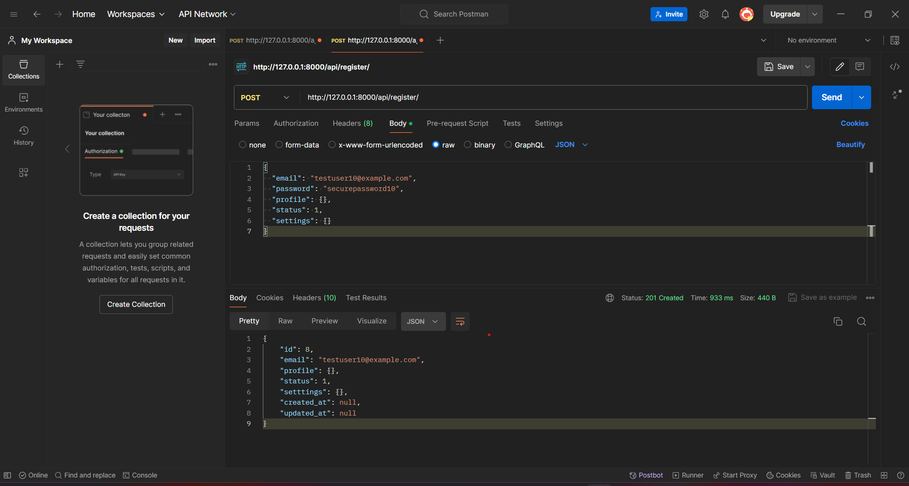
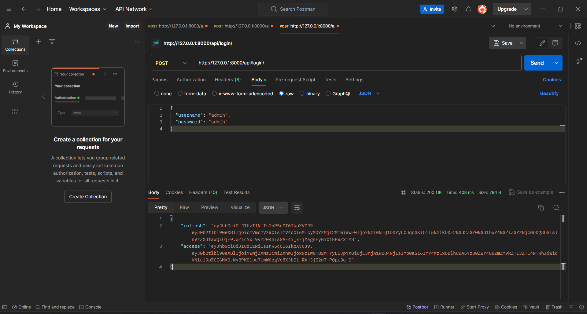
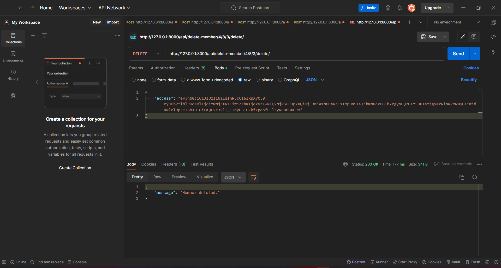

```markdown
# Django Project
https://github.com/deebadithya
This is a Django project that includes basic user management, organization management, and member roles.

## Prerequisites

- Python 3
- PostgreSQL
- pip 
```
## Setup Instructions

### 1. Clone the Repository

```bash
git clone https://github.com/deebadithya/test_project.git
cd test_project
```

### 2. Create a Virtual Environment

Create a virtual environment

```bash
python -m venv .venv
```

### 3. Activate the Virtual Environment

#### Windows

```bash
.venv\Scripts\Activate.ps1
```

#### macOS/Linux

```bash
source .venv/bin/activate
```

### 4. Install the Requirements

Install the required packages using pip.

```bash
pip install -r requirements.txt
```

### 5. Configure the Database

Update your `settings.py` file with your PostgreSQL database credentials.

```python
DATABASES = {
    'default': {
        'ENGINE': 'django.db.backends.postgresql',
        'NAME': '<database_name>',
        'USER': '<username>',
        'PASSWORD': '<password>',
        'HOST': 'localhost',
        'PORT': '5432',
    }
}
```

### 6. Apply Migrations

Create and apply the necessary database migrations.

```bash
python manage.py makemigrations
python manage.py migrate
```

### 7. Create a Superuser

Create a superuser to access the Django admin panel.

```bash
python manage.py createsuperuser
# Follow the prompts to set the username, email, and password
```

### 8. Run the Server

Start the Django development server.

```bash
python manage.py runserver
```


### User Management

- **Register**: `/api/register/` (POST)
 
- **Login**: `/api/login/` (POST)
  
- **Reset Password**: `/api/reset-password/` (POST)
- 

### Organisation Management

- **Invite Member**: `/api/invite-member/` (POST)
- **Delete Member**: `/api/delete-member/<int:org_id>/<int:user_id>/<int:role_id>/delete/` (DELETE)
  
- **Update Member Role**: `/api/update-member-role/<int:member_id>/` (PUT)


